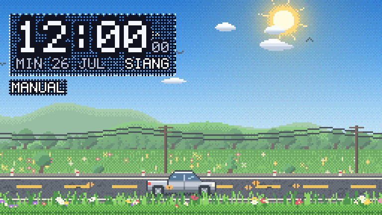
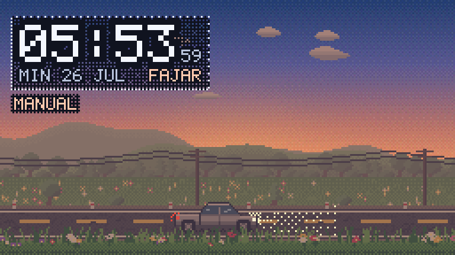
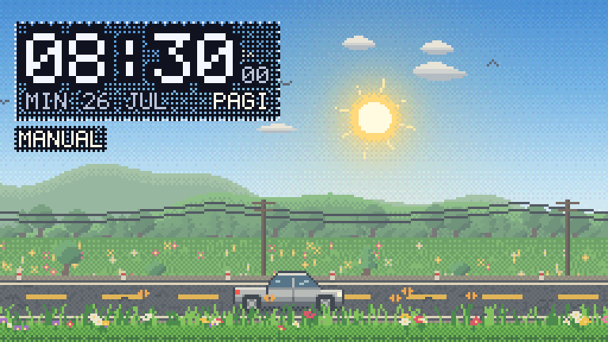
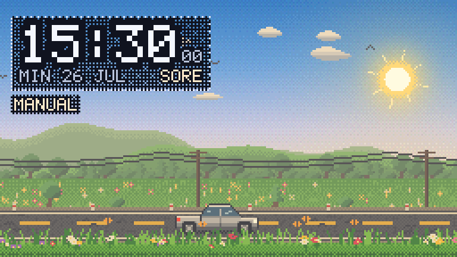
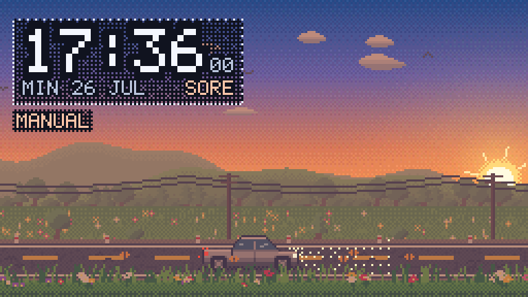
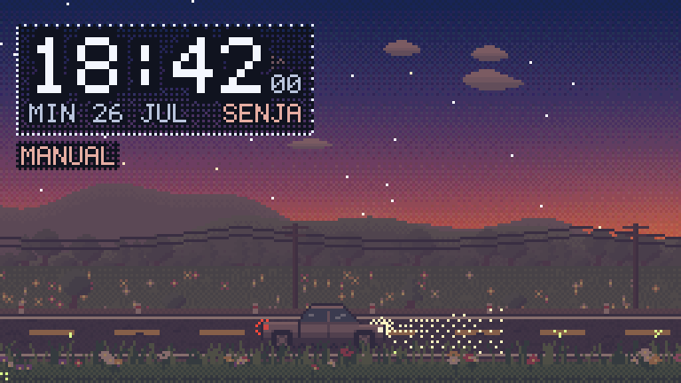
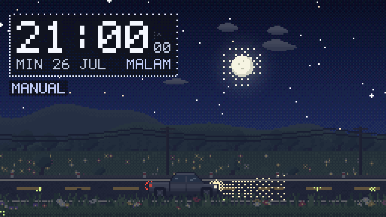
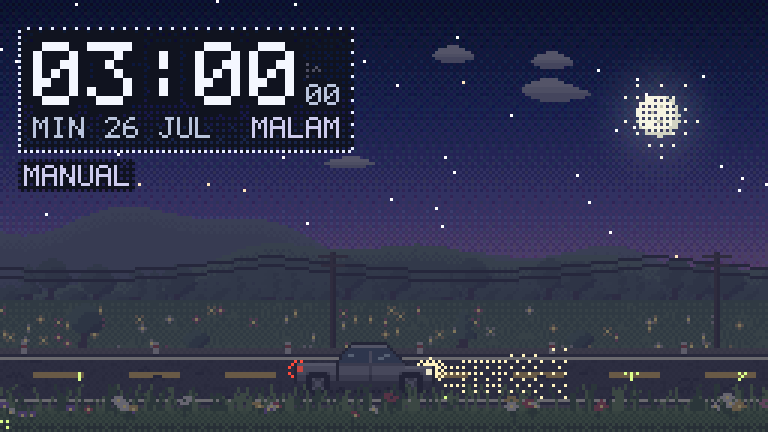

<div align="center">

# 🚙 Pixel Drive Clock

**Widget jam pixel-art untuk desktop Windows.**
Sebuah pickup silver melintasi lapangan bunga, dan seluruh suasananya
mengikuti waktu asli — dari fajar, siang terik, senja jingga, sampai malam
berbintang. Peralihannya berjalan mulus seperti cahaya alam, bukan berganti
tiba-tiba.



[](#-kebutuhan-sistem)
[](https://www.electronjs.org/)
[](LICENSE)
[](#-kenapa-ringan)

</div>

> **English summary** — A pixel-art desktop clock widget for Windows. A silver
> pickup drives through a flower field while the whole scene follows the real
> time of day with seamless lighting transitions. Every pixel is generated by
> code (no image files), the entire asset payload is 118 KB, and it idles at
> ~0.65% CPU. Requirements are in [§ Kebutuhan sistem](#-kebutuhan-sistem);
> the rest of this document is in Indonesian.

---

## 📑 Daftar isi

- [Tampilan sepanjang hari](#-tampilan-sepanjang-hari)
- [Fitur](#-fitur)
- [Kebutuhan sistem](#-kebutuhan-sistem)
- [Cara memasang](#-cara-memasang)
- [Catatan penting sebelum dipakai](#-catatan-penting-sebelum-dipakai)
- [Cara memakai](#-cara-memakai)
- [Kenapa ringan](#-kenapa-ringan)
- [Membangun sendiri](#-membangun-sendiri)
- [Memodifikasi](#-memodifikasi)
- [Pemecahan masalah](#-pemecahan-masalah)
- [Struktur proyek](#-struktur-proyek)
- [Lisensi](#-lisensi)

---

## 🌄 Tampilan sepanjang hari

Semua gambar di bawah dihasilkan oleh widget ini sendiri, bukan mockup.

| Fajar 05:54 | Pagi 08:30 |
|:---:|:---:|
|  |  |
| **Siang 12:00** | **Sore 15:30** |
|  |  |
| **Senja 17:36** | **Magrib 18:42** |
|  |  |
| **Malam 21:00** | **Dini hari 03:00** |
|  |  |

Selengkapnya ada di folder [`preview/`](preview/).

---

## ✨ Fitur

### Jam

- **Format 12 atau 24 jam**, detik dan tanggal bisa dinyalakan/dimatikan.
- **Label fase hari** otomatis: `SUBUH · FAJAR · PAGI · SIANG · SORE · SENJA · MALAM`.
- **Tanggal berbahasa Indonesia**: `MIN 26 JUL`, nama hari dan bulan disingkat.
- Font pixel **5×7 buatan sendiri** — ikut membesar dengan tajam di semua
  ukuran, tidak pernah buram.

### Pengubah waktu (tiga mode)

| Mode | Fungsi |
|---|---|
| **Realtime** | Ikut jam Windows. Bisa digeser ke zona waktu lain; **WIB, WITA, dan WIT** sudah diberi label khusus. |
| **Manual** | Anda tentukan jamnya lewat penggeser (ketelitian 1 menit). Jam **dan** suasana langsung ikut berubah. |
| **Demo** | Satu hari penuh diputar cepat (10–240 detik per hari, bawaan 60 detik). Cara tercepat melihat peralihan siang→malam. |

### Pemandangan

- **Siklus cahaya mulus 24 jam** — bukan sekadar tukar gambar siang/malam.
  Langit, bukit, rumput, aspal, dan bodi mobil selalu berubah **bersama-sama**.
- **Matahari** dengan sinar berdenyut, terbit dan terbenam di lengkung langit.
- **Bulan** dengan halo lembut dan kawah, plus **bintang berkelip** dan
  sesekali **bintang jatuh**.
- **Cahaya horizon** jingga saat fajar dan senja.
- **Lampu mobil menyala sendiri** saat gelap, lengkap dengan kerucut cahaya
  yang meredup ke depan dan genangan cahaya di aspal.
- **7 lapisan parallax**: awan, bukit jauh, bukit dekat, deretan pohon, ladang
  bunga, tiang listrik berkabel, jalan aspal, dan rumput depan.
- **Detail hidup**: roda berputar, asap knalpot, debu ban, patok reflektor,
  rumput yang bergoyang tertiup angin (4 frame), burung dan kupu-kupu di siang,
  kunang-kunang di malam.
- **Bayangan mobil** ikut arah dan ketinggian matahari.

### Widget

- Jendela **tanpa bingkai, transparan, sudut membulat**.
- **Selalu di atas** jendela lain (bisa dimatikan).
- **Geser bebas** — seret langsung gambarnya.
- **4 ukuran**: 1× (256×144) sampai 4× (1024×576), semuanya kelipatan bulat
  sehingga pixel tetap tajam.
- **Ikon tray** dengan menu cepat.
- **Transparansi** bisa diatur 35–100%.
- **Jalan otomatis saat Windows menyala** (opsional).
- Setelan **tersimpan otomatis**, termasuk posisi terakhir di layar.

---

## 💻 Kebutuhan sistem

> Angka RAM dan CPU di bawah adalah **hasil pengukuran nyata** pada widget yang
> sudah dipaket, bukan perkiraan. Diukur di Windows 11, prosesor 8 core,
> RAM 16 GB, dalam kondisi widget berjalan tanpa difokuskan (skenario
> pemakaian sehari-hari).

### Minimum

| Komponen | Kebutuhan | Catatan |
|---|---|---|
| **Sistem operasi** | **Windows 10 64-bit** atau lebih baru | Windows 7, 8, dan 8.1 **tidak didukung** — dukungannya dihapus sejak Electron 23. |
| **Prosesor** | x64 (Intel/AMD), 2 core | Widget hanya dirilis dalam versi **x64**. |
| **RAM terpasang** | **4 GB** | Widget sendiri memakai ±109 MB RAM privat. |
| **Ruang disk** | **400 MB** kosong | 301 MB untuk aplikasi + ruang sementara installer. |
| **Kartu grafis** | **Tidak perlu** | Seluruh gambar dihitung di CPU. Mode hemat RAM bahkan mematikan akselerasi hardware secara bawaan. |
| **Resolusi layar** | **1024 × 600** | Cukup untuk ukuran widget 1× dan 2×. |
| **Hak akses** | **Tidak perlu admin** | Installer memasang ke folder pengguna. |
| **Internet** | **Tidak perlu** | Widget tidak pernah mengakses jaringan saat berjalan. |
| **.NET / Visual C++ Redist** | **Tidak perlu** | Semua kebutuhan sudah ikut di dalam paket. |

### Direkomendasikan

| Komponen | Rekomendasi | Alasan |
|---|---|---|
| **Sistem operasi** | **Windows 11 64-bit** | Dukungan penuh dan terbaru dari Chromium 150. |
| **Prosesor** | x64 4 core atau lebih | Pemakaian CPU turun jadi tidak terasa sama sekali. |
| **RAM terpasang** | **8 GB** atau lebih | Nyaman dipakai bersama browser dan aplikasi lain. |
| **Ruang disk** | **1 GB** kosong | Longgar untuk pembaruan versi berikutnya. |
| **Resolusi layar** | **1920 × 1080** | Nyaman untuk ukuran widget 3× dan 4×. |
| **Penskalaan tampilan** | **100 %, 150 %, atau 200 %** | Pada skala ini pixel-nya jatuh di kelipatan bulat sehingga paling tajam. Skala 125 % dan 175 % tetap jalan, hanya sedikit kurang rata. |

### Pemakaian sumber daya (terukur)

| Metrik | Nilai |
|---|---|
| RAM privat | **±109 MB** |
| RAM working set | ±255 MB |
| CPU saat tidak difokuskan | **±0,65 %** dari 8 core |
| Jumlah proses | 4 (bawaan Chromium) |
| Ukuran terpasang di disk | 301,4 MB |
| Ukuran installer | 87 MB |
| **Kode + aset widget sendiri** | **118 KB** |

### Yang perlu diperhatikan

- **Windows on ARM** — widget ini dirilis khusus **x64**. Di **Windows 11 ARM**
  ia tetap bisa berjalan lewat emulasi x64 bawaan Windows, dengan pemakaian RAM
  dan CPU sedikit lebih tinggi. Di **Windows 10 ARM** ia **tidak akan
  berjalan**, karena Windows 10 ARM hanya bisa mengemulasi x86 (32-bit).
- **Windows Server** tidak diuji. Secara teknis Server 2016 ke atas memakai
  kernel yang sama, tetapi ikon tray dan jendela transparan bergantung pada
  komponen desktop yang tidak selalu ada di instalasi Server Core.
- **Mesin virtual / Remote Desktop** tetap jalan karena tidak butuh GPU, tetapi
  animasinya bisa terasa kurang halus akibat pembatasan laju gambar dari sisi
  RDP.

### Kalau ingin membangun sendiri dari kode

| Komponen | Kebutuhan |
|---|---|
| **Node.js** | **20.0 atau lebih baru** (diuji dengan 24.18) |
| **npm** | 9 atau lebih baru |
| **Ruang disk** | **1,5 GB** (`node_modules` ±430 MB, hasil build ±475 MB) |
| **RAM** | 4 GB (batasi heap V8 bila kurang — lihat [Pemecahan masalah](#-pemecahan-masalah)) |
| **Internet** | Perlu, untuk mengunduh Electron ±137 MB saat pertama kali |
| **Git** | Opsional, hanya untuk mengambil kode |

---

## 📥 Cara memasang

Ambil berkasnya dari halaman **[Releases](../../releases)**:

| Berkas | Untuk siapa |
|---|---|
| **`PixelDriveClock-1.0.0-setup.exe`** | **Kebanyakan orang.** Installer biasa: klik dua kali, pilih folder, selesai. Membuat pintasan di Start Menu dan Desktop. Tidak perlu hak admin. |
| **`PixelDriveClock-1.0.0-portable.exe`** | **Tanpa dipasang.** Satu berkas, klik langsung jalan. Cocok ditaruh di flashdisk. |

> Kedua berkas itu sengaja **tidak disimpan di dalam repo** (87 MB masing-masing).
> Git bukan tempat menyimpan hasil build. Kalau Anda membangun sendiri,
> hasilnya muncul di folder `dist/`.

### Mencabut pemasangan

Settings → Apps → **Pixel Drive Clock** → Uninstall.

Setelan Anda **sengaja tidak ikut terhapus** supaya aman saat memperbarui
versi. Kalau ingin benar-benar bersih, hapus juga folder ini:

```
%APPDATA%\pixel-drive-clock
```

---

## ⚠️ Catatan penting sebelum dipakai

**1. Windows akan menampilkan peringatan saat pertama dijalankan.**

Layar biru bertuliskan *"Windows protected your PC"* akan muncul. Ini **normal**
dan bukan berarti berkasnya berbahaya — penyebabnya berkas `.exe` ini belum
ditandatangani dengan sertifikat digital, yang harganya ratusan dolar per tahun.

Klik **More info** → **Run anyway**.

**2. Antivirus kadang ikut curiga.**

Beberapa antivirus menandai aplikasi Electron yang belum ditandatangani sebagai
mencurigakan. Kalau ragu, Anda bisa memeriksa sendiri seluruh kodenya di repo
ini, atau membangun installer-nya sendiri dari sumber (lihat
[Membangun sendiri](#-membangun-sendiri)).

**3. Widget ini tidak mengambil data apa pun.**

Tidak ada koneksi internet, tidak ada telemetri, tidak ada akun. Satu-satunya
berkas yang ditulis adalah setelan Anda di `%APPDATA%\pixel-drive-clock`.
Renderer-nya berjalan tanpa akses Node sama sekali (`contextIsolation: true`,
`nodeIntegration: false`) dengan aturan keamanan konten `default-src 'none'`.

**4. Widget tidak muncul di taskbar.**

Ini disengaja — namanya juga widget. Untuk memunculkan atau menutupnya, pakai
**ikon tray** di dekat jam Windows. Kalau ikon tray gagal dibuat karena suatu
hal, widget otomatis kembali muncul di taskbar supaya tetap bisa Anda jangkau.

**5. Jam mengikuti jam Windows.**

Kalau jam widget terasa salah, periksa dulu jam dan zona waktu Windows Anda.
Kalau memang ingin zona waktu lain, atur dari panel setelan, bukan dengan
mengubah jam sistem.

---

## 🖱 Cara memakai

| Tindakan | Caranya |
|---|---|
| **Memindahkan** | Seret langsung gambarnya |
| **Membuka pengaturan** | Arahkan kursor ke widget lalu klik ikon ⚙ di kanan atas, **atau klik kanan** di mana saja pada widget |
| **Menutup pengaturan** | Tombol ✕ di panel, atau tekan `Esc` |
| **Menyembunyikan** | Tombol `–` (widget masuk ke tray) |
| **Memunculkan lagi** | Klik ikon tray di dekat jam Windows |
| **Menutup total** | Tombol `✕`, atau klik kanan ikon tray → Keluar |

### Isi panel pengaturan

- **Sumber waktu** — Realtime / Manual / Demo
- **Zona waktu** — 38 pilihan, WIB/WITA/WIT sudah dilabeli
- **Tampilan jam** — tampilkan/sembunyikan jam, format 12/24, detik, tanggal, label fase, panel gelap
- **Ukuran widget** — 1× / 2× / 3× / 4×
- **Kecepatan mobil** — 0–100 (0 berarti mobil berhenti)
- **Kehalusan animasi** — 15 / 30 / 60 fps, plus mode hemat daya
- **Transparansi** — 35–100 %
- **Selalu di atas jendela lain**
- **Jalan otomatis saat Windows menyala**
- **Mode hemat RAM** — mematikan proses GPU (berlaku setelah dijalankan ulang)
- **Kembalikan ke bawaan**

---

## 🪶 Kenapa ringan

Widget jam yang menyala 24 jam tidak boleh boros. Ini yang dilakukan:

1. **Semuanya digambar di kanvas 256 × 144** lalu diperbesar dengan
   `image-rendering: pixelated`. Berapa pun ukuran widget di layar, yang
   dihitung tetap hanya **36.864 pixel**.
2. **Latar dirender sekali, dipakai berulang.** Bukit, pohon, ladang, aspal,
   dan tiang listrik digambar ke "tile" hanya ketika palet warna berubah. Tiap
   frame cuma sekitar **20 perintah `drawImage`**.
3. **Palet dibangun paling cepat 5×/detik**, dan pada mode realtime praktis
   hanya **sekali per 30 detik** — warna langit tidak perlu dihitung ulang 60
   kali per detik.
4. **Batas 30 fps** (bisa diubah), turun otomatis ke **12 fps** saat widget
   tidak difokuskan.
5. **Berhenti menggambar total** saat jendela disembunyikan.
6. **Mode hemat RAM** mematikan akselerasi hardware. Karena seluruh gambar
   memang dihitung di CPU dan tidak ada WebGL sama sekali, proses GPU Chromium
   nyaris tidak bekerja tapi tetap memakan RAM. Mematikannya menghemat
   **34 MB RAM privat tanpa menambah beban CPU sedikit pun** — terukur.
7. **Nol dependensi runtime.** Tidak ada React, tidak ada framework, tidak ada
   bundler.
8. **Tidak ada satu pun berkas gambar.** Semua pixel-art dibuat dengan kode dan
   ditulis sebagai ASCII di dalam sumber. Itulah kenapa seluruh aset widget
   hanya **118 KB**, dan kenapa warnanya bisa mengikuti cahaya secara
   otomatis — hal yang mustahil dilakukan sprite PNG statis.

---

## 🔨 Membangun sendiri

```bash
git clone https://github.com/Goodman-34/Widget-time-pixel-style-.git
cd Widget-time-pixel-style-
npm install
```

| Perintah | Fungsi |
|---|---|
| `npm start` | Menjalankan widget langsung dari kode |
| `npm run validate` | Memeriksa sprite, font, dan palet (6 pemeriksaan) |
| `npm run icon` | Membuat ulang ikon dari pixel-art |
| `npm run capture` | Menyimpan PNG pemandangan pada 10 jam berbeda |
| `npm run build` | Membuat installer + portable ke folder `dist/` |

Butuh Node.js 20+. Belum ada? `winget install OpenJS.NodeJS.LTS`.

---

## 🎨 Memodifikasi

Tidak perlu editor gambar sama sekali.

### Mengubah bentuk atau warna mobil

Buka [`src/renderer/js/sprites.js`](src/renderer/js/sprites.js). Mobilnya
ditulis apa adanya sebagai gambar ASCII 48 × 18:

```
'...................KKKKKKKKKKKK.................',
'..................KHHHHHHHHHHHHK................',
'.................KWWWWWWWWWWWWWWK...............',
```

`.` berarti transparan; setiap huruf lain dipetakan ke nama warna lewat
`CAR_MAP` di atasnya (`K` garis tepi, `H` sorot terang, `B` badan, `W` kaca,
`T` ban, `L` lampu depan, dan seterusnya).

**Aturan satu-satunya: semua baris harus sama panjang.** Setelah mengedit:

```bash
npm run validate
```

Skrip itu akan menunjukkan baris mana yang panjangnya salah, huruf mana yang
belum punya warna, dan apakah posisi pelek masih pas.

### Mengubah suasana atau warna langit

Buka [`src/renderer/js/palette.js`](src/renderer/js/palette.js):

1. **`M`** — warna dasar setiap benda. Ubah `carBody` kalau ingin mobil merah,
   `fieldNearLight` untuk warna rumput, dan seterusnya.
2. **`KEYS`** — 12 keyframe pencahayaan sepanjang 24 jam: warna gradien langit,
   warna dan kuat cahaya, warna ambient, saturasi, kabut, cahaya horizon, serta
   opasitas matahari/bulan/bintang/lampu.

Warna akhir **tidak** ditulis tangan untuk tiap jam, melainkan dihitung:

```
albedo → × warna cahaya → × kuat cahaya → campur ke ambient
       → koreksi saturasi → campur ke kabut sesuai kedalaman
```

Karena semua parameter di-interpolasi mulus (`smoothstep`) dan pencampurannya
dilakukan di ruang linear, mengubah **satu** keyframe membuat seluruh dunia
ikut menyesuaikan diri secara konsisten. `npm run validate` juga akan gagal
kalau ada lompatan warna yang terlalu tajam antar menit.

### Mengubah tata letak pemandangan

Batas tiap lapisan ada di bagian atas
[`src/renderer/js/scene.js`](src/renderer/js/scene.js), lengkap dengan diagram
vertikalnya. Faktor parallax ada di `PX_FACTOR`.

---

## 🔧 Pemecahan masalah

<details>
<summary><b>Widget tidak muncul setelah dijalankan</b></summary>

Cek ikon tray di dekat jam Windows dan klik sekali. Kalau setelan tersimpan
membuatnya berada di luar layar (misalnya monitor kedua dicabut), widget akan
otomatis dikembalikan ke dalam layar saat dijalankan berikutnya.

Kalau masih bermasalah, hapus berkas setelan lalu jalankan ulang:

```
%APPDATA%\pixel-drive-clock\settings.json
```
</details>

<details>
<summary><b>Tampilannya aneh, berkedip, atau layar hitam</b></summary>

Buka pengaturan → matikan **Mode hemat RAM** → jalankan ulang widget. Mode itu
mematikan akselerasi hardware; pada segelintir driver lama, justru menyalakannya
lebih stabil.
</details>

<details>
<summary><b>Pixel-nya terlihat kurang rata</b></summary>

Ini terjadi kalau penskalaan tampilan Windows diatur ke 125 % atau 175 %, karena
ukuran widget jadi jatuh di kelipatan pecahan. Pakai penskalaan 100 %, 150 %,
atau 200 % untuk hasil paling tajam, atau ganti ukuran widget ke angka lain.
</details>

<details>
<summary><b>"Jalan otomatis saat Windows menyala" tidak bekerja</b></summary>

Kalau Anda memakai versi **portable** dan memindahkan berkas `.exe`-nya setelah
mengaktifkan opsi itu, pendaftarannya jadi menunjuk ke lokasi lama. Matikan lalu
nyalakan lagi opsi tersebut dari lokasi yang baru.
</details>

<details>
<summary><b><code>npm run build</code> gagal dengan "out of memory"</b></summary>

Pernah terjadi `Zone Allocation failed - process out of memory` padahal RAM
bebas masih 4 GB. Penyebabnya proses anak Node tidak diizinkan meng-commit
memori sebanyak yang diminta V8 secara bawaan. Dua hal yang menyelesaikannya —
yang pertama sudah diterapkan di repo ini:

1. `"npmRebuild": false` di `package.json` (proyek ini nol dependensi native,
   jadi langkah `@electron/rebuild` memang tidak diperlukan).
2. Batasi heap V8 saat memanggil build:

```powershell
node --max-old-space-size=1024 --max-semi-space-size=8 `
     node_modules\electron-builder\out\cli\cli.js --win nsis portable
```
</details>

<details>
<summary><b><code>npm start</code> mendadak tidak memunculkan apa-apa</b></summary>

Proses `electron-builder` pernah membuat biner Electron di `node_modules`
menjadi rusak (`electron.exe` menyusut dari 215 MB menjadi 0,5 MB) sehingga
Electron keluar diam-diam tanpa pesan apa pun. Periksa dulu:

```powershell
(Get-Item node_modules\electron\dist\electron.exe).Length / 1MB
```

Kalau angkanya jauh di bawah 200, pasang ulang binernya:

```bash
npm install --save-dev electron@43.2.0 --force
```

Masih 0,5 MB juga setelah itu? Berarti npm Anda (versi 11+) memblokir skrip
pemasangan paket. Jalankan pengunduhnya langsung:

```bash
node node_modules/electron/install.js
```

Karena itu, jalankan `npm run build` sebagai **langkah terakhir**, bukan di
tengah-tengah saat Anda masih bolak-balik menguji dengan `npm start`.
</details>

---

## 📁 Struktur proyek

```
src/
  main.js               proses utama Electron: jendela, tray, setelan, IPC
  preload.js            jembatan aman renderer <-> main (tanpa akses Node)
  assets/               ikon (dibuat oleh skrip, bukan digambar tangan)
  renderer/
    index.html          rangka + panel pengaturan
    style.css           tampilan widget & panel
    js/
      font.js           font pixel 5x7 buatan sendiri, 51 glyph
      sprites.js        SEMUA pixel-art, ditulis sebagai ASCII
      palette.js        model pencahayaan 24 jam  <- inti "peralihan mulus"
      pixel.js          primitif: dithering, sprite, teks, lingkaran
      scene.js          mesin pemandangan: lapisan, parallax, cache
      clock.js          sumber waktu (realtime / manual / demo)
      app.js            setelan, antarmuka, loop render
tools/
  make-icon.js          pembuat ikon PNG (encoder PNG mini, nol dependensi)
  validate-sprites.js   pemeriksa kewarasan aset & palet
preview/                contoh tangkapan tiap fase hari
```

Dokumen lain:

- [`CHANGELOG.md`](CHANGELOG.md) — catatan perubahan tiap versi.
- [`CONTRIBUTING.md`](CONTRIBUTING.md) — cara ikut berkontribusi, dari
  persiapan sampai daftar periksa sebelum pull request.
- [`SECURITY.md`](SECURITY.md) — cara melaporkan celah keamanan, dan batas
  keamanan yang dirancang di widget ini.
- [`SUPPORT.md`](SUPPORT.md) — ke mana bertanya kalau ada masalah.
- [`CODE_OF_CONDUCT.md`](CODE_OF_CONDUCT.md) — kode etik ruang proyek ini.

---

## 📄 Lisensi

[MIT](LICENSE) — bebas dipakai, diubah, dan disebarkan.

Mobilnya adalah pickup kabin ganda bergaya umum, tanpa logo atau nama merek
apa pun.
